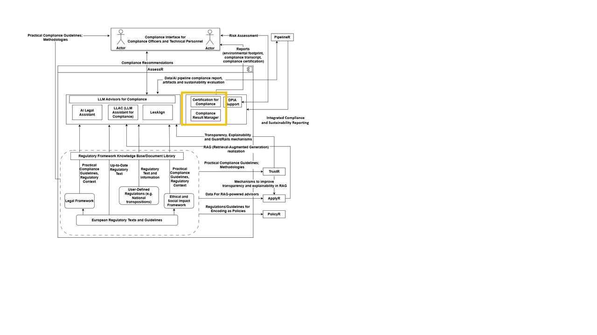

  <h1>DPIA Support Module</h1>
  

## **General Description**
This tool serves as a one-stop shop for accessing certification reports, fully integrated with the DATAPACT platform. Built on a customized off-the-shelf Content Management System, it supports reports generated by multiple tools while providing centralized, secure access for users to retrieve certifications in real time. The system features a dynamic Certification Dashboard, enabling on-demand visual reports with metrics such as completion rates, certification statuses, and compliance tracking for informed decision-making. It also includes smart version control for certificates, ensuring users always reference the most up-to-date documents

## **Related Compliance aspects**
- Acccess to certification

## **Main Goal/Functionalities**
- rpvide access to Compliance Certification

## **Architecture**
The picture below shows the component in the DATAPACT architecture.

## **Component Definition**
Compliance Result Manager is a purpose-built solution designed to streamline and strengthen the collection, management, and analysis of compliance results. At its core, the tool leverages the capabilities of the DATAPACT platform, a robust framework for centralizing data from multiple sources and enabling secure, real-time access. The system applies structured workflows to consolidate compliance outcomes, track adherence to policies and regulations, and provide reproducible visual reports for informed decision-making. It also incorporates smart version control and direct pointers to relevant usage policies and legislative guidelines, ensuring transparency and accountability across compliance processes.

## **Commercial Information**

| Organisation (s) | License Nature | License |
|------------------|----------------|---------|
| University of Southampton  | Open Source | TBD |

## **Expected KPIs**

|What (types)|How(Process)|Values|
|------------|------------|------|
|information completeness and clarity|	User Satisfaction|>90%|

## **Related Project Links**
| Project Links |
| ------------- | 	
| Software GitHub Repository --> Result Manager <https://github.com/DATAPACT/Certification-Result-Manager> |

## **How To Install**
N/A.

### Detailed steps

The custom version for DATAPACT is still under development.

## **How To Use**

N/A

## **Other Information**

n/a

## **OpenAPI Specification**

n/a

## **Additional Links**

n/a

