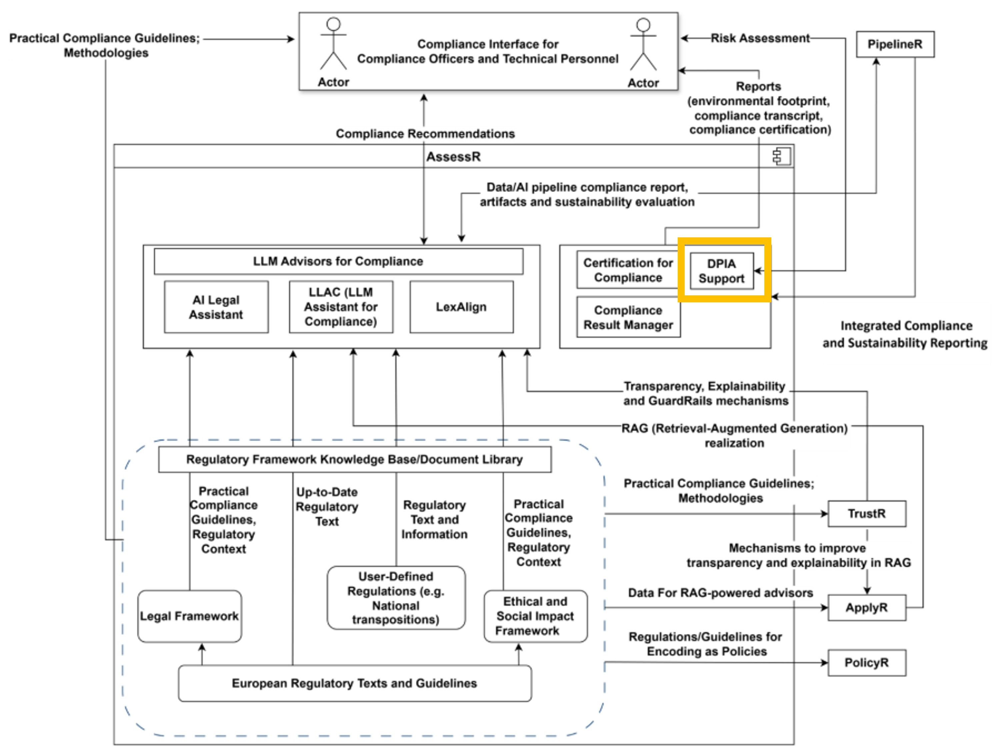
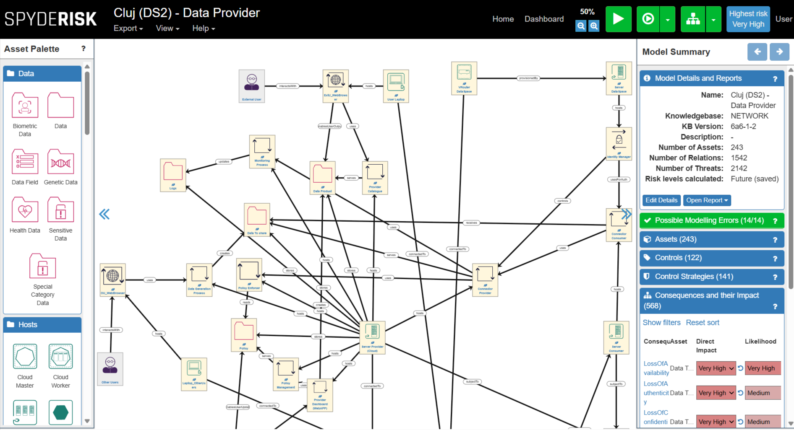

  <h1 style="margin:0;">DPIA Support Module</h1>
  

| Project Links |
| ------------- | 	
| Software GitHub Repository --> Spyderisk software <https://github.com/Spyderisk> | //use to refer to external repositories

## **General Description**
DPIA Support is a streamlined tool designed to assist users in creating comprehensive Data Protection Impact Assessment (DPIA) documents. 
Leveraging the capabilities of the existing Spyderisk platform, it enables users to perform detailed system model risk assessments, generating the insights needed for inclusion in a DPIA. The tool features a graphical user interface that simplifies navigation and interaction, while providing intuitive risk and data-flow reporting to help stakeholders clearly understand potential privacy risks and data movement within the system.

## **Related Compliance aspects**
- Data Protection Impact Assessment
- Risk Assessment

## **Main Goal/Functionalities**
- Perform system model risk assessment to be included in the DPIA document
- Graphical User Interface
- Intuitive risk and data-flow reporting

## **Architecture**
The picture below shows the component in the DATAPACT architecture.

## **Component Definition**
DPIA Support is a purpose‑built solution designed to streamline and strengthen the creation of Data Protection Impact Assessment (DPIA) documents. At its core, the tool leverages the existing capabilities of Spyderisk, a robust open‑source risk assessment and modelling platform originally developed to analyse complex socio-technical systems and security threats. Spyderisk applies structured methodologies such as those outlined in ISO 27005 to identify and quantify risks based on system models, enabling comprehensive and reproducible evaluation of threats, consequences, and control strategies.

At a more technical level, DPIA Support allows users to perform detailed system model risk assessments with Spyderisk, producing reports that include both risk analysis and data-flow mapping. These outputs are exactly the information needed to complete a DPIAso this tool directly supports as key document in necessary for compliance purposes

## **Screenshots**

## **Commercial Information**

| Organisation (s) | License Nature | License |
|------------------|----------------|---------|
| University of SOuthampton  | Open Source | TBD |

## **How To Install**
Tool is provided as a service.

### Detailed steps

The custom version for DATAPACT is still under development.
The software is accessible at https://github.com/Spyderisk 

## **How To Use**

* Spyderisk online documentation: https://docs.spyderisk.org/system-modeller/latest/

## **Other Information**

n/a

## **OpenAPI Specification**

n/a

## **Additional Links**

n/a
