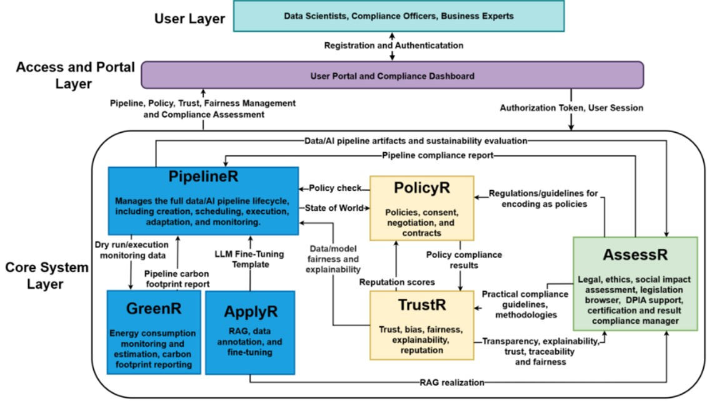

  <h1>General Architectrure</h1>
  

## User Layer 

This top user layer represents the human actors who interact with the DataPACT ecosystem: 
- Data Scientists and Data/AI Engineers are technical stakeholders responsible for designing, implementing, and operating data/AI pipelines. 
- Compliance Officers (Data Protection, Ethics, Risk) are governance users responsible for defining policies, assessing compliance risks, and reviewing certification reports. 
- Business Experts provide domain-specific requirements and consume the high-level outputs. 
- Access and Toolbox User Interface Layer 

This middle layer serves as the unified entry point and security gateway for the system. 

Registration and authentication are central services that handle user identity and issue Authorisation Tokens and User Sessions to authenticated users. 
The Toolchain user interface (UI) and Compliance Dashboard provide a unified graphical UI (GUI), allowing users to manage pipelines, define policies, and view compliance assessments. They also act as the orchestration point, sending high-level commands (Pipeline, Policy, Trust, Fairness Management) to the core system layer. 

## Core System Layer 

The bottom layer is the DataPACT system containing the six interconnected R-containers that execute the project’s logic: 

**PipelineR** is the central hub for Pipeline Lifecycle Management, receiving policy checks from PolicyR, LLM fine-tuning templates from ApplyR, and pipeline compliance reports from AssessR. Additionally, PipelineR incorporates implementations of data/model fairness, as well as explainability, in pipelines, as provided by TrustR. It sends pipeline artefacts to AssessR and provides dry run and execution monitoring data to GreenR. 

**GreenR** handles energy consumption monitoring and estimation. It ingests monitoring data from PipelineR and returns a pipeline carbon footprint report to PipelineR, as well as a sustainability evaluation to AssessR (via PipelineR). 

**ApplyR** provides RAG, data annotation, and fine-tuning templates. It sends LLM fine-tuning templates to PipelineR and RAG realisation artefacts to AssessR for validation. 

**AssessR** is the hub for legal, ethical, and social impact assessments. It aggregates evidence, pipeline artefacts from PipelineR, and RAG realisation from ApplyR to generate a final pipeline compliance report. 

**PolicyR** manages privacy policies, user consent, and smart contracts. It receives the state of the world from PipelineR, performs validation, and returns the policy checks. 

**TrustR** provides bias detection, explainability, reputation, and decentralised audit trails. While shown alongside PolicyR, it contributes to the overall compliance assessment ecosystem by delivering trust and fairness of metrics. 

The architecture follows a user-centric, layered approach. Stakeholders do not interact directly with the complex underlying microservices. Instead, they authenticate through a secure Toolchain UI that issues a session token, which authorises interactions with the underlying toolboxes. The workflow is cyclic and interconnected: 

- A Data Scientist uses PipelineR to design a pipeline, pulling templates from ApplyR. 

- Before execution, PipelineR consults PolicyR to ensure the design meets privacy rules and GreenR to estimate the carbon footprint.

- Afterwards, it sends the complete design (artefacts) to AssessR for a holistic review of its legal and ethical implications. 

- If compliant, the pipeline can execute, with GreenR and TrustR monitoring runtime metrics to ensure ongoing adherence to the compliance-by-design principles. 

Afterwards, it sends the complete design (artefacts) to AssessR for a holistic review of its legal and ethical implications. 

If compliant, the pipeline can execute, with GreenR and TrustR monitoring runtime metrics to ensure ongoing adherence to the compliance-by-design princip
