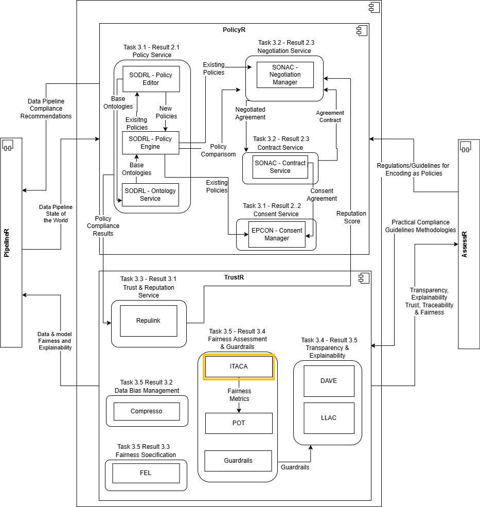
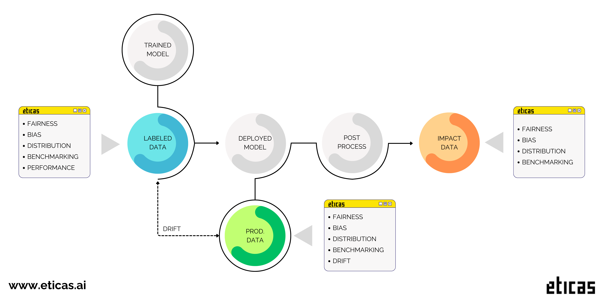

<div class="tool-header">
  <h1>ITACA (eticas-audit)</h1>
  <a href="https://eticas.ai">
    
  </a>
</div>

## **General Description**
ITACA (eticas-audit) is an open-source Python library for rigorous, reproducible auditing of AI systems across fairness, demographic representation, feature–outcome relationships, performance, and drift. It provides a comprehensive set of tools to ensure transparency, accountability, and ethical AI development by comparing privileged and underprivileged groups across all stages of the model lifecycle. Metrics are computed locally on datasets and returned as Python-native artifacts suitable for visualization, storage, CI gating, or downstream governance workflows. Data, configuration, and results remain entirely within the local analytical environment.

## **Related Compliance Aspects**
- Fairness & Non-discrimination
- Bias Assessment (EU AI Act, Article 10 — Data and Data Governance)
- Risk Management (ISO/IEC 42001 — AI Management System)

## **Main Goal/Functionalities**
- Bias & Fairness assessment across the full AI model lifecycle
- Non-discrimination monitoring for protected attributes
- Model lifecycle auditing and drift detection between training and operational phases
- Demographic benchmarking: group representation and outcome distribution analysis
- Feature distribution analysis: detection of proxy variables correlated with protected attributes
- Fairness auditing: Disparate Impact, Statistical Parity, Equalized Odds, Calibration metrics
- Per-group performance evaluation: accuracy, precision, recall, F1-score comparison
- Flexible configuration of simple and intersectional sensitive attributes via JSON schema

## **Architecture**
The picture below shows the component in the DataPACT architecture. ITACA is part of the **Fairness Assessment & Guardrails** component within **TrustR** (WP3), contributing to Result R3.4.



*Figure: WP3 Component Diagram (D3.1) — ITACA highlighted within the Fairness Assessment & Guardrails component of TrustR.*

ITACA operates as a model-agnostic auditing library that ingests data to compute baseline metrics for fairness across the whole lifecycle of an AI model. During the training phase, these metrics can be fed into the Pareto Optimal Tradeoff (POT) tool for multi-objective trade-off analysis between fairness, robustness, and quality.

ITACA supports three lifecycle stages:
- **Pre-processing (Labeled Audit):** Audits the training dataset with ground truth labels, computing fairness, performance, benchmarking, and distribution metrics.
- **Post-processing (Production Audit):** Audits operational/production data without true labels, computing fairness, benchmarking, and distribution metrics.
- **Impact (Impact Audit):** Audits real-world outcome data after decisions have been made, measuring actual impact on different groups.

Additionally, a **Drift Audit** compares training vs. operational data to detect distribution shifts that may erode fairness or performance over time.

## **Component Definition**
ITACA is a Python library for rigorous, reproducible auditing of AI systems. It currently supports **binary classifiers**, accepting either hard labels (e.g., {0, 1}) or scores/probabilities with a decision threshold. Metrics are computed and organized by subgroup and overall aggregates, then exposed as serializable Python structures for plotting, exporting, and CI checks.

Core capabilities span five complementary areas:

- **Demographic Benchmarking** characterizes group representation and the distribution of positive outcomes, highlighting under- or over-representation and imbalances in allocation.
- **Model Fairness** quantifies parity with established measures such as disparate impact (selection-rate ratio), statistical parity difference, equalized-odds-style diagnostics, and groupwise calibration.
- **Features Distribution Analysis** surfaces potential proxies and leakage by examining relationships among inputs, protected attributes, and outcomes, flagging indirect discrimination risks.
- **Performance Evaluation** reports overall and per-group quality — accuracy, precision, recall, F1, and simple baselines — to distinguish localized unfairness from uniform model weakness.
- **Drift Monitoring** compares training and operational (or time-separated) data and behavior to detect shifts that may erode fairness or performance.

Audits are structured around protected (sensitive) variables — attributes representing legally or ethically protected characteristics. Both single-attribute and intersectional specifications (e.g., sex × ethnicity) are supported via a compact JSON configuration schema.

## **Screenshots**



*Figure 1: ITACA metric computation flow — from input data and sensitive attribute configuration through audit stages to fairness, benchmarking, distribution, performance, and drift results.*

## **Commercial Information**

| Organisation(s) | License Nature | License |
|------------------|----------------|---------|
| Eticas Research and Consulting SL | Open Source | Apache 2.0 |

## **Technical Characteristics**

| Property | Value |
|----------|-------|
| **Keywords** | Fairness, Bias, Disparate Impact, Statistical Parity, Equalized Odds, Drift, Audit, Binary Classifier |
| **TRL (Initial → Final)** | TRL 5 → TRL 6 |
| **Licence** | Open Source (Apache 2.0) |
| **Github Page** | https://github.com/eticasai/eticas-audit |
| **Access** | Python library, local/offline mode |
| **Standards** | EU AI Act, ISO/IEC 42001 (compliance support) |
| **Compliance certification output** | YES |
| **Tools already integrated with** | Designed for integration with Pareto Optimal Tradeoff Tool (UC) |

## **Expected KPIs**

| What (types) | How (Process) | Values (concrete values) |
|--------------|---------------|--------------------------|
| Use case applicability and audit execution | Assess each DataPACT use case for ITACA compatibility (binary classification task, availability of protected attributes, dataset readiness); execute audits on applicable use cases | Applicability assessment completed for all use cases; ITACA audits successfully executed on ≥2 applicable use cases |
| Fairness metric computation across audit types | Run the audit types that match each use case's lifecycle stage and data availability (labeled, production, drift); compute all available metrics per audit type | ≥2 distinct audit types executed per integrated use case; full metric set computed without errors for each audit stage |
| Bias detection validation on benchmark data | Compare ITACA fairness metric outputs (Disparate Impact, Statistical Parity, Equalized Odds) against known biased/unbiased benchmark datasets with established ground truth | ITACA correctly flags known bias in benchmark datasets; metric results consistent with published reference values (e.g., FEL ECAI benchmarks such as Adult, COMPAS) |
| Integration with Pareto Optimal Tradeoff Tool | Verify that ITACA fairness metric outputs are consumed by POT for multi-objective trade-off analysis between fairness, robustness, and quality | Successful end-to-end data exchange with POT in ≥1 use case |

## **Related Project Links**

| Project Links |
|---------------|
| Software GitHub Repository → eticas-audit source code: https://github.com/eticasai/eticas-audit |
| PyPI package: https://pypi.org/project/eticas-audit/ |
| Eticas website: https://eticas.ai/itaca/ |
| DataPACT Deliverable D3.1 — Compliance Toolbox v1 (Section 10.1) |
| DataPACT Deliverable D4.1 — Compliance Framework v1 (Risk Category: Bias & Fairness) |

## **How To Install**

### Requirements
- Python ≥ 3.8

### Installation

```bash
pip install eticas-audit
```

### Quick Start

```python
from eticas.model.ml_model import MLModel

# 1. Define sensitive attributes
sensitive_attributes = {
    "sensitive_attributes": {
        "gender": {
            "columns": [{"name": "gender", "underprivileged": [2]}],
            "type": "simple"
        },
        "ethnicity": {
            "columns": [{"name": "ethnicity", "privileged": [1]}],
            "type": "simple"
        }
    }
}

# 2. Create model
model = MLModel(
    model_name="My Model Audit",
    description="Fairness audit for binary classifier",
    country="EU",
    sensitive_attributes=sensitive_attributes,
    features=["feature_0", "feature_1", "feature_2"]
)

# 3. Run a labeled audit
model.run_labeled_audit(
    dataset_path='data/training_data.csv',
    label_column='outcome',
    output_column='predicted_outcome',
    positive_output=[1]
)

# 4. Run a production audit
model.run_production_audit(
    dataset_path='data/production_data.csv',
    output_column='predicted_outcome',
    positive_output=[1]
)

# 5. Run a drift audit
model.run_drift_audit(
    dataset_path_dev='data/training_data.csv',
    output_column_dev='outcome',
    positive_output_dev=[1],
    dataset_path_prod='data/production_data.csv',
    output_column_prod='predicted_outcome',
    positive_output_prod=[1]
)

# 6. Explore results (normalized 0–100)
results_df = model.df_results(norm_values=True)
results_json = model.json_results(norm_values=True)
```

### Available Metrics

| Group | Metric | Label needed? | Description |
|-------|--------|---------------|-------------|
| Fairness | d_parity | No | Ratio of selection rates (Disparate Impact) |
| Fairness | d_statisticalparity | No | Difference in selection rates (Statistical Parity) |
| Fairness | d_equality | No | Whether the system treats all groups equally |
| Fairness | d_equity | No | Whether outcomes account for group needs |
| Fairness | d_equalodds_true | Yes | Equal true positive rates across groups |
| Fairness | d_equalodds_false | Yes | Equal false positive rates across groups |
| Fairness | d_calibrated_true | Yes | Same meaning of positive prediction across groups |
| Fairness | d_calibrated_false | Yes | Same meaning of negative prediction across groups |
| Benchmarking | da_inconsistency | No | % of samples from underprivileged group |
| Benchmarking | da_positive | No | % of positive outcomes from underprivileged group |
| Distribution | dxa_inconsistency | No | Proxy feature detection |
| Distribution | da_informative | No | Relationship between protected attributes and output |
| Performance | accuracy, F1, precision, recall | Yes | Standard classification metrics per group |
| Drift | drift | No | Distribution shift between training and operational data |

### Detailed Documentation

For full documentation, example notebooks, and API details, see the [eticas-audit repository](https://github.com/eticasai/eticas-audit).
