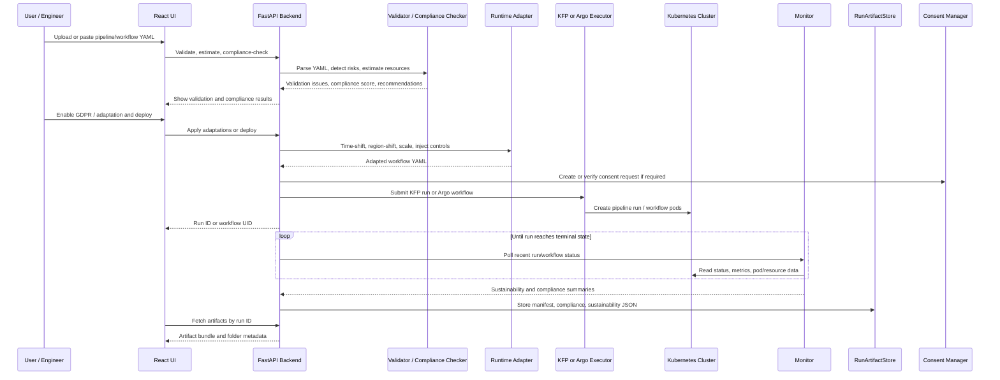

# KubePipe Complete Architecture

This diagram shows the main KubePipe runtime architecture: React UI, FastAPI backend, core pipeline services, execution backends, monitoring, compliance, adaptation, consent, and artifact storage.

```mermaid
flowchart TB
  %% -----------------------------------------------------------------------
  %% Actors and entry points
  %% -----------------------------------------------------------------------
  subgraph actors[Users and Roles]
    user[Data and AI Pipeline User]
    engineer[Compliance / Data Protection Engineer]
    officer[Ethics / Risk Officer]
  end

  subgraph clients[Client Interfaces]
    web[React Web UI\nlocalhost:3000]
    cli[KubePipe CLI\ncli.py / cli_converter.py]
    apiDocs[OpenAPI Docs\n/api docs]
  end

  user --> web
  engineer --> web
  officer --> web
  user --> cli
  engineer --> apiDocs

  %% -----------------------------------------------------------------------
  %% Frontend layer
  %% -----------------------------------------------------------------------
  subgraph frontend[Frontend Application - ui/src]
    layout[Layout and Routing\nApp.jsx / Layout.jsx]
    dashboard[Dashboard]
    pipelineMgmt[Pipeline Management\nKFP + Argo unified view]
    validatorPanel[Workflow Validator\nValidation + Dry Run + Compliance]
    adaptationPanel[Runtime Adaptation Panel]
    sustainabilityPage[Sustainability Page]
    compliancePage[Compliance Page]
    artifactPanel[Run Artifact Panel\nView / Download / Copy API URL]
    apiClient[API Client\nAxios wrapper]
  end

  web --> layout
  layout --> dashboard
  layout --> pipelineMgmt
  layout --> sustainabilityPage
  layout --> compliancePage
  pipelineMgmt --> validatorPanel
  pipelineMgmt --> adaptationPanel
  pipelineMgmt --> artifactPanel
  dashboard --> apiClient
  pipelineMgmt --> apiClient
  validatorPanel --> apiClient
  adaptationPanel --> apiClient
  sustainabilityPage --> apiClient
  compliancePage --> apiClient
  artifactPanel --> apiClient
  cli --> pipelineApi
  apiDocs --> healthApi

  %% -----------------------------------------------------------------------
  %% Backend API layer
  %% -----------------------------------------------------------------------
  subgraph backend[FastAPI Backend - kubepipe/api/main.py\nlocalhost:8001]
    healthApi[Health / Stats / Services APIs]
    simulationApi[Simulation / Compile / Execute APIs]
    pipelineApi[KFP Pipeline APIs\nlist / upload / delete / create run]
    runApi[Run APIs\nstatus / list / artifacts]
    argoApi[Argo APIs\ndeploy / list / status / delete / artifacts]
    workflowApi[Workflow APIs\nvalidate / estimate / compliance / PII]
    adaptationApi[Adaptation APIs\nforecast / analyze / apply / adapt-and-deploy]
    consentApi[Consent APIs\nowners / requesters / approve / revoke / audit]
    metricsApi[Metrics APIs\ncluster / pods / nodes / workflow]
    staticArtifacts[Static Artifact Serving\n/artifacts]
  end

  apiClient --> healthApi
  apiClient --> simulationApi
  apiClient --> pipelineApi
  apiClient --> runApi
  apiClient --> argoApi
  apiClient --> workflowApi
  apiClient --> adaptationApi
  apiClient --> consentApi
  apiClient --> metricsApi
  apiClient --> staticArtifacts

  %% -----------------------------------------------------------------------
  %% Core services
  %% -----------------------------------------------------------------------
  subgraph core[Core KubePipe Services - kubepipe/core]
    compiler[KubePipeCompiler\nCompile local pipeline to YAML]
    executor[KubePipeExecutor\nSubmit KFP/local runs]
    simulator[KubePipeSimulator\nResource simulation / dry run]
    argoExecutor[ArgoWorkflowExecutor\nKubernetes custom-object operations]
    monitor[KubePipeMonitor\nRecent runs / sustainability / compliance]
    validator[WorkflowValidator\nSyntax / dependency / security / compliance checks]
    complianceChecker[Compliance Checker + Injector\nKFP and Argo GDPR controls]
    runtimeAdapter[Runtime Adaptation Engine\nCarbon-aware + compliance + resource strategies]
    piiScanner[PII Scanner]
    piiAnonymizer[PII Anonymizer]
    consentManager[Consent Manager\nrequest lifecycle + audit trail]
    artifactStore[RunArtifactStore\nmanifest + compliance + sustainability JSON]
    dashboardGen[Dashboard Generator]
  end

  simulationApi --> simulator
  simulationApi --> compiler
  simulationApi --> executor
  pipelineApi --> compiler
  pipelineApi --> executor
  runApi --> executor
  runApi --> monitor
  runApi --> artifactStore
  argoApi --> argoExecutor
  argoApi --> consentManager
  argoApi --> artifactStore
  workflowApi --> validator
  workflowApi --> complianceChecker
  workflowApi --> piiScanner
  workflowApi --> piiAnonymizer
  adaptationApi --> runtimeAdapter
  adaptationApi --> validator
  adaptationApi --> argoExecutor
  consentApi --> consentManager
  metricsApi --> monitor
  healthApi --> monitor
  healthApi --> dashboardGen
  staticArtifacts --> artifactStore

  %% -----------------------------------------------------------------------
  %% Observe, engage, act loop
  %% -----------------------------------------------------------------------
  subgraph aiops[Observe - Engage - Act AIOps Loop]
    observe[Observe\nCollect run status, pod metrics, energy, CO2, PII, compliance signals]
    engage[Engage\nConsent decisions, reports, audit trail, mitigations, priority actions]
    act[Act\nInject controls, adapt workflow, deploy updated pipeline]
  end

  monitor --> observe
  metricsApi --> observe
  artifactStore --> observe
  consentManager --> engage
  complianceChecker --> engage
  runtimeAdapter --> engage
  engage --> act
  complianceChecker --> act
  runtimeAdapter --> act
  argoExecutor --> act
  executor --> act

  %% -----------------------------------------------------------------------
  %% Execution backends and cluster resources
  %% -----------------------------------------------------------------------
  subgraph execution[Execution Backends]
    kfp[Kubeflow Pipelines\nKFP SDK / KFP UI\nlocalhost:8080]
    argo[Argo Workflows\nArgo CRDs / Argo Server\nlocalhost:2746]
    local[Local / Mock Execution\nDemo pipeline mode]
  end

  executor --> kfp
  executor --> local
  argoExecutor --> argo
  compiler --> kfp
  runtimeAdapter --> argo

  subgraph cluster[Kubernetes / Minikube Cluster]
    kfpNs[kubeflow namespace\nml-pipeline service / KFP pods]
    argoNs[argo namespace\nworkflow controller / workflow pods]
    metricsServer[metrics-server\nkubectl top / pod and node metrics]
    minio[MinIO / S3 Artifacts\nmlpipeline bucket]
    k8sApi[Kubernetes API Server]
  end

  kfp --> kfpNs
  argo --> argoNs
  argoExecutor --> k8sApi
  monitor --> k8sApi
  metricsApi --> metricsServer
  monitor --> metricsServer
  argoNs --> minio
  kfpNs --> minio

  %% -----------------------------------------------------------------------
  %% Storage, artifacts, and configuration
  %% -----------------------------------------------------------------------
  subgraph storage[Local State and Artifacts]
    config[kubepipe.yaml + env vars\nexecution, paths, monitoring]
    artifacts[artifacts/\ncompiled YAML, generated outputs]
    runArtifacts[artifacts/run_artifacts/<run_id>/\nmanifest.json\ncompliance.json\nsustainability.json]
    carbonTracker[artifacts/carbontracker*\nCarbonTracker local training measurements]
    consentStore[data/consent_store.json\nconsent requests + audit log]
    outputs[outputs/\nmodel outputs and demos]
  end

  healthApi --> config
  simulationApi --> config
  pipelineApi --> config
  argoApi --> config
  compiler --> artifacts
  artifactStore --> runArtifacts
  monitor --> carbonTracker
  consentManager --> consentStore
  local --> outputs
  staticArtifacts --> artifacts
  staticArtifacts --> runArtifacts

  %% -----------------------------------------------------------------------
  %% External services and standards
  %% -----------------------------------------------------------------------
  subgraph external[External Data and Standards]
    carbonApis[Electricity Maps / WattTime optional APIs]
    gdpr[GDPR / DATAPACT consent model]
    standards[ISO 23894 / Green Software Foundation practices]
  end

  runtimeAdapter --> carbonApis
  monitor --> standards
  complianceChecker --> gdpr
  consentManager --> gdpr

  %% -----------------------------------------------------------------------
  %% Outputs
  %% -----------------------------------------------------------------------
  subgraph outputsLayer[Primary Outputs]
    deployments[Pipeline and Workflow Deployments]
    reports[Compliance, Sustainability, Consent Reports]
    recommendations[Adaptation Recommendations]
    jsonArtifacts[Per-run JSON Artifacts]
    dashboards[Operational Dashboards]
  end

  kfp --> deployments
  argo --> deployments
  monitor --> reports
  consentManager --> reports
  runtimeAdapter --> recommendations
  artifactStore --> jsonArtifacts
  dashboard --> dashboards
```

## Main Runtime Flow

## Layer Summary

| Layer | Main Components | Responsibility |
|---|---|---|
| Client | React UI, CLI, OpenAPI docs | User interaction, deployment forms, monitoring views, artifact viewer |
| API | FastAPI endpoints | Unified access to KFP, Argo, validation, adaptation, consent, metrics, artifacts |
| Core services | Compiler, executor, monitor, validator, compliance checker, runtime adapter, consent manager, artifact store | Pipeline lifecycle automation and policy-aware transformations |
| Execution | Kubeflow Pipelines, Argo Workflows, local/mock mode | Actual workflow execution targets |
| Cluster | Kubernetes API, namespaces, metrics-server, MinIO | Runtime substrate, pod metrics, workflow artifacts |
| Storage | artifacts, run_artifacts, consent_store, CarbonTracker outputs | Persisted compliance/sustainability evidence and generated outputs |
| Outputs | Deployments, reports, recommendations, JSON artifacts, dashboards | Evidence and operational results exposed to users |
