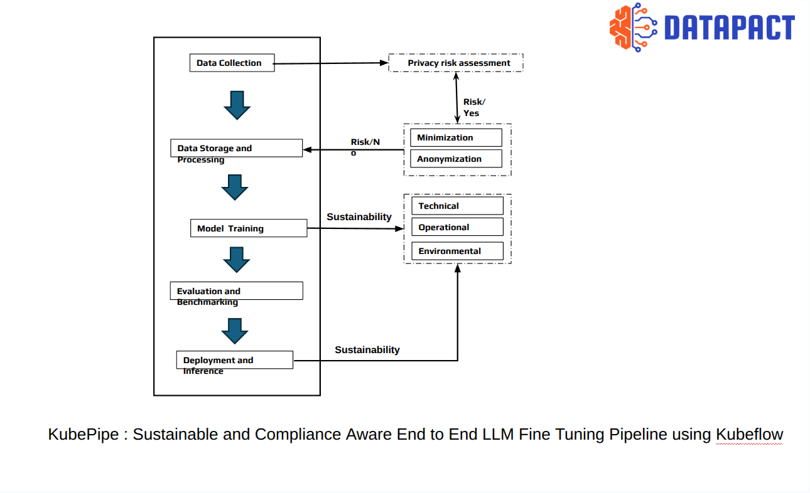
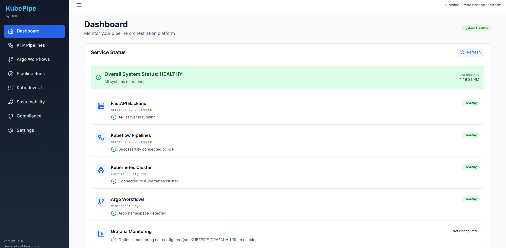

<div class="tool-header">
  <h1>KubePipe</h1>
  <a href="https://www.uibk.ac.at/">
    
  </a>
</div>

## **General Description**
KubePipe is a unified pipeline orchestration platform designed to bridge Kubeflow Pipelines and Argo Workflows with built-in GDPR compliance and sustainability awareness. It enables users to deploy, monitor, and manage ML pipelines across both orchestrators from a single interface, while automatically assessing privacy risks, injecting compliance controls, and tracking carbon footprint and energy consumption per pipeline run.

## **Related Compliance Aspects**
- GDPR Compliance (PII anonymization, data minimization, consent verification, pseudonymization)
- Sustainability & Carbon-Aware Computing (ISO 23894, Green Software Foundation)
- Risk Assessment (ISO/IEC 23894:2023 AI Risk Management)

## **Main Goal/Functionalities**
- Unified management of Kubeflow Pipelines and Argo Workflows
- Automatic GDPR compliance checking and one-click auto-injection of privacy controls
- Consent management with full lifecycle (register, request, approve/reject/revoke, audit)
- Per-run energy (kWh) and CO₂ (kg) tracking using real Kubernetes metrics
- Runtime adaptation: time-shifting, region-shifting, dynamic resource scaling
- Workflow validation, dry-run simulation, and Argo→KFP YAML conversion
- React Web UI with real-time monitoring dashboard

## **Architecture**
The picture below shows the component in the DATAPACT architecture.


## **Component Definition**
KubePipe is a purpose-built solution that streamlines ML pipeline orchestration with integrated compliance and sustainability features. At its core, it leverages Kubeflow Pipelines (KFP v2) and Argo Workflows (v3) as execution backends, abstracting both behind a unified REST API (48 endpoints) and React-based Web UI. The compliance engine analyzes pipeline YAML for 8 GDPR checks (PII anonymization, consent verification, data minimization, pseudonymization, security contexts, audit logging, data retention, access controls) and can auto-inject missing controls. The sustainability engine measures per-run energy consumption using a SOTA model based on Strubell et al. (2019) with actual Kubernetes metrics-server data and region-specific carbon intensity factors, enabling carbon-aware scheduling decisions.

## **Screenshots**


## **Commercial Information**

| Organisation(s) | License Nature | License |
|------------------|----------------|---------|
| University of Innsbruck | Open Source | TBD |

## **Expected KPIs**

| What (Types) | How (Process) | Values |
|---|---|---|
| Unified ML pipeline orchestration (KFP + Argo) with GDPR compliance checks and auto-injection,  and carbon-aware sustainability tracking | Analyzes pipeline YAML for 8 GDPR checks, auto-injects missing controls; measures per-run energy using SOTA model (Strubell et al. 2019) with real K8s metrics + regional carbon intensity; gates execution on consent status | Compliance: 0–100 score (≥90 Excellent, <40 Critical). Energy: per-run kWh + kg CO₂. Standards: ISO 23894, Green Software Foundation. API: 48 endpoints. |

## **Related Project Links**

| Project Links |
|---|
| Software GitHub Repository --> KubePipe <https://github.com/DATAPACT/Kubepipe> |

## **How To Install**

### Prerequisites
- Python 3.10+ with [uv](https://github.com/astral-sh/uv)
- Node.js 18+ (for Web UI)
- Docker & Minikube (for Kubernetes features)

### Detailed Steps

```bash
git clone https://github.com/DATAPACT/Kubepipe.git
cd Kubepipe
python3 setup.py
# — or —
bash scripts/start_all.sh
```

| Service | URL |
|---------|-----|
| Backend API | http://127.0.0.1:8001 |
| Web UI | http://localhost:3000 |
| Argo Server | https://localhost:2746 |
| MinIO Console | http://localhost:9001 |

For accurate energy and carbon measurements, install the Kubernetes metrics-server:

```bash
kubectl apply -f https://github.com/kubernetes-sigs/metrics-server/releases/latest/download/components.yaml
```

## **How To Use**

### Argo Workflows

```bash
kubepipe argo-deploy examples/argo/hello-world.yaml   # Deploy
kubepipe argo-status <workflow-name>                   # Status
kubepipe argo-list                                     # List all
kubepipe argo-delete <workflow-name>                   # Delete
```

### Kubeflow Pipelines

```bash
kubectl -n kubeflow port-forward svc/ml-pipeline 8888:8888

curl -X POST http://127.0.0.1:8001/api/v1/execute \
  -H 'Content-Type: application/json' \
  -d '{"pipeline_id":"demo","environment":"dev","parameters":{}}'
```

### Argo → Kubeflow Conversion

```bash
uv run python demo_converter.py
```

### Configuration

```yaml
# kubepipe.yaml
execution:
  mode: "mock"  # mock | kfp
  kfp_host: "http://127.0.0.1:8888"
```

## **Other Information**

### Documentation
- [UI Guide](docs/UI_GUIDE.md)
- [Runtime Adaptation](docs/RUNTIME_ADAPTATION.md)
- [Service Monitoring](docs/SERVICE_MONITORING.md)
- [Validation & Compliance](docs/VALIDATION_AND_COMPLIANCE.md)
- [Troubleshooting](docs/TROUBLESHOOTING.md)

### Contact
**University of Innsbruck**
- 📧 rajashekar.kolichala@uibk.ac.at
- 📧 radu.prodan@uibk.ac.at

### Acknowledgments
Funded by Horizon Europe (grant 101189771, DataPACT)

## **OpenAPI Specification**

| Endpoint | Method | Description |
|----------|--------|-------------|
| `/api/v1/execute` | POST | Execute KFP pipeline |
| `/api/v1/runs/{id}` | GET | Get run status |
| `/api/v1/argo/deploy` | POST | Deploy Argo workflow |
| `/api/v1/argo/workflows` | GET | List workflows |
| `/api/v1/workflows/validate` | POST | Validate workflow YAML |
| `/api/v1/workflows/dry-run` | POST | Dry-run with resource estimates |
| `/api/v1/workflows/compliance-check` | POST | GDPR compliance analysis |
| `/api/v1/adaptation/carbon-forecast` | GET | Carbon intensity forecast |
| `/api/v1/adaptation/analyze` | POST | Analyze adaptation opportunities |
| `/api/v1/adaptation/apply` | POST | Apply runtime adaptations |
| `/api/v1/metrics/status` | GET | Check metrics-server status |
| `/api/v1/metrics/cluster` | GET | Real-time cluster metrics |

Interactive API docs available at: http://127.0.0.1:8001/docs

## **Additional Links**

n/a
