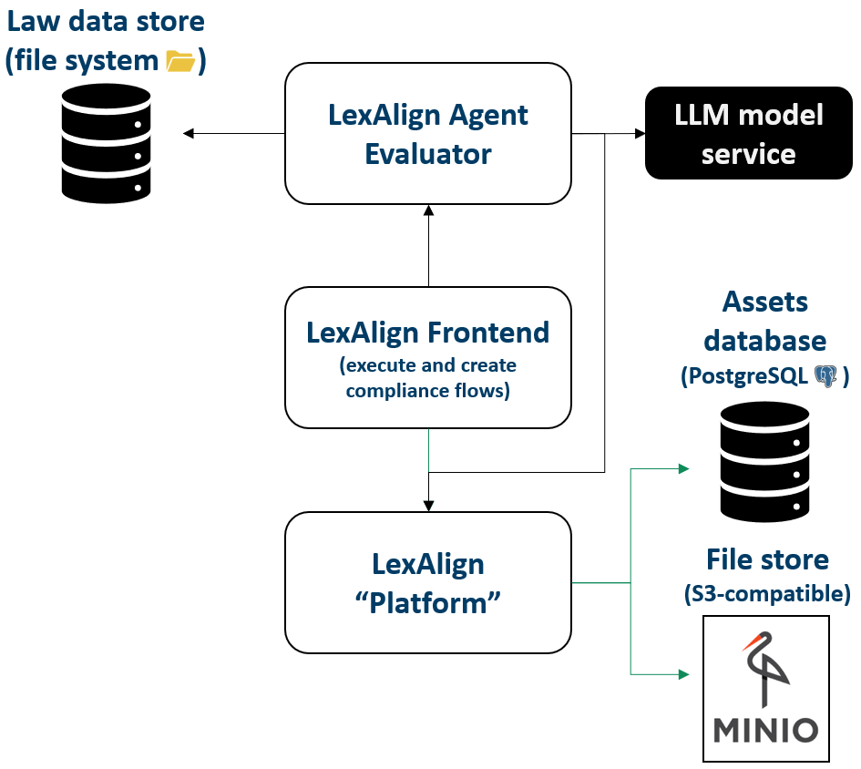
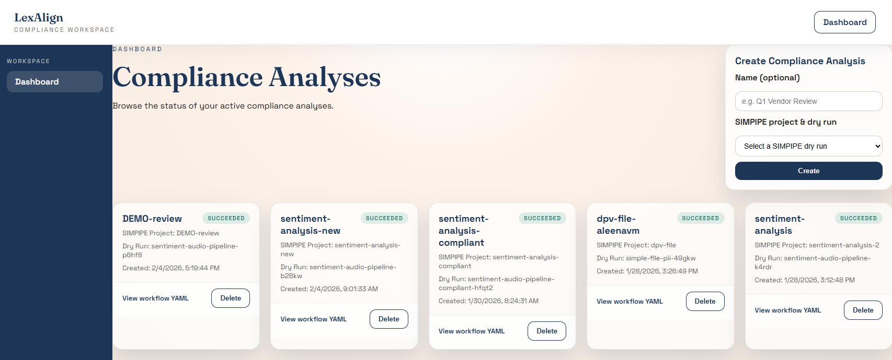
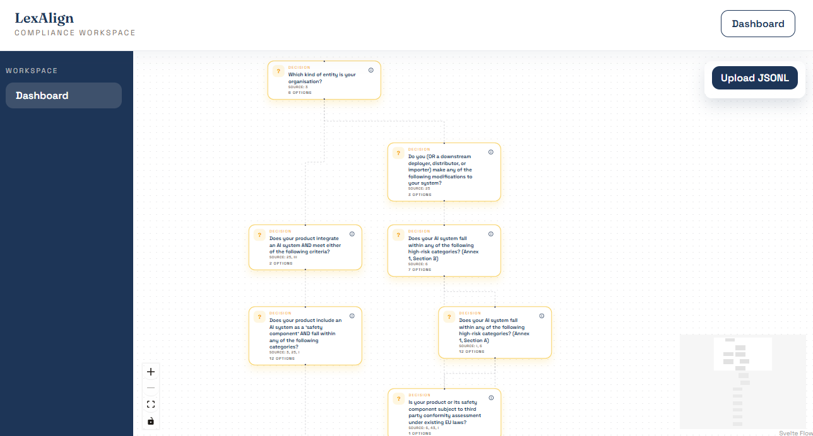

  <h1>LexAlign</h1>
  

## **General Description**
LexAlign is a multi-service application that supports compliance analysis through configurable compliance flows. It provides a platform for managing compliance evaluation projects, an editor for building and visualizing flow executions, and an agentic evaluator for stage-by-stage analysis. The system integrates with external tools (e.g., SIMPIPE) for pipeline metadata and artifacts, and supports data storage in S3-compatible object storage for workflow assets and derived outputs.

## **Related Compliance aspects**
- AI Act compliance analysis
- Data governance and audit readiness

## **Main Goal/Functionalities**
- Create and manage compliance analyses
- Browse and execute compliance flows with structured inputs and derived facts
- Integrate with external pipeline systems and persist artifacts in object storage
- Visualize decision-tree flowcharts for compliance reasoning

## **Architecture**
The picture below shows the LexAlign architecture.

## **Component Definition**
LexAlign is a modular compliance analysis environment designed to manage compliance analyses across complex AI and data pipelines. The platform offers a Django-based backend that persists compliance analysis records, structured user inputs, derived facts, and pipeline assets. It integrates with external services such as SIMPIPE to obtain pipeline specifications and artifacts, which are stored in S3-compatible object storage (MinIO in development).

The frontend provides a dashboard for analyses, structured regulatory context collection, and a flowchart visualization of decision logic. The system supports lazy retrieval of pipeline artifacts, linking analysis data to real pipeline steps, and organizing evidence and decision metadata for later compliance reporting.

## **Screenshots**

## **Commercial Information**

| Organisation (s) | License Nature | License |
|------------------|----------------|---------|
| SINTEF | Open Source | [Apache License 2.0](../LICENSE) |

## **Expected KPIs**

|What (types)|How(Process)|Values|
|------------|------------|------|
|Compliance flow accuracy on mutated pipelines|Mutation-style evaluation: start with compliant Argo Workflows, apply non-compliance mutation operators, run each compliance flow, build confusion matrix (TP/TN/FP/FN) per flow, and compute accuracy = (TP+TN)/(TP+TN+FP+FN).|>= 90% accuracy per flow|

## **Related Project Links**
| Project Links |
| ------------- |
| n/a |

## **How To Install**

1. Clone the repository: https://github.com/datapact/LexAlign
2. Follow the project setup instructions in the root README (run the required Docker Compose commands to start the platform, database, and storage services).

## **How To Use**

n/a

## **Other Information**

n/a

## **OpenAPI Specification**

n/a

## **Additional Links**

n/a
