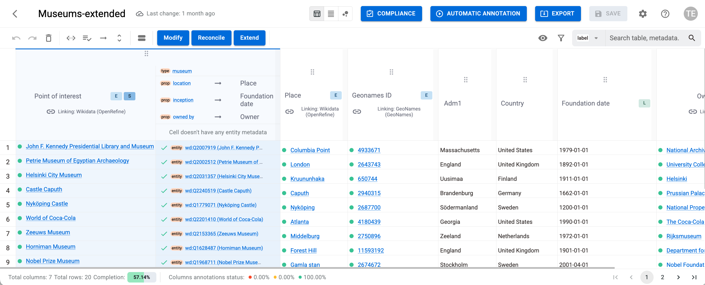

# SemT-X framework

Powered by 

[](https://www.unimib.it/)

| Project Links |
| ------------- | 	
| Software GitHub Repository --> SemT-X software <[https://github.com/I2Tunimib](https://github.com/I2Tunimib)> | //use to refer to external repositories

## **General Description**
SemT-X is a modular framework designed to support the semantic description, enrichment, alignment, and interoperability of tabular data. It also enables users to invoke compliance services to verify and validate data, and to receive guidance on enforcing any prescriptions required to ensure compliance.

SemT-X guides users in the design of enrichment pipelines and in verifying their compliance by supporting the discovery of available enrichment and compliance services, the testing of their capabilities, and their use within the specific domain of the data to be enriched. Once the design is completed, the resulting pipeline can be exported as Python scripts to ensure the replicability of the intended workflow. These Python scripts can be executed interactively as notebooks, run as batch tools, or used as a basis for generating cloud-based pipelines. The most suitable execution mode depends on user needs and on the volume of data to be processed; cloud-based pipelines are typically appropriate only when handling very large datasets.

Comprehensive documentation is available at:
https://i2tunimib.github.io/I2T-docs/


## **Architecture**
<p align="center">
  
  <br/>
  <em>SemT-X Architecture</em>
</p>

## **Component Definition**
The framework adopts a service-based architecture, making it easily extensible to address specific technical and business requirements. 

A central component of the **SemT-X** architecture is the **back-end (SemTX-backend)**, which serves both as an advanced gateway to data enrichment services (modification, reconciliation, and extension) and as a manager of the datasets and tables involved (including model definition and storage of enriched data).

Access to the backend is provided through a **Web API**, which is used by a graphical front-end (**SemT-UI**) implemented as a web application, and by a **Python library (**SemT-Py**)** that enables programmatic access — for example, from a Jupyter Notebook.

**SemT-X** is designed so that new external services can be easily integrated by developers, following the framework’s structure and conventions.

### Service Structure

Each service within the framework is organized into three main components:

```jsx title="Service structure"
📦serviceId
 ┣ 📜index.js
 ┣ 📜requestTransformer.js
 ┗ 📜responseTransformer.js
```
The _index.js_ file defines the main properties and configuration parameters of the service to be integrated.
The _requestTransformer.js_ component is responsible for adapting the data received from the front-end to the format required by the target service API.
Conversely, the _responseTransformer.js_ component performs the reverse operation, ensuring that the data returned by the external service is converted into the structure expected by the front-end.

Comprehensive documentation describing the implementation details and integration procedures is available at:
https://i2tunimib.github.io/I2T-docs/

## **Screenshots**
SemT-X features are accessible interactively via a graphical user interface (SemT-UI) running in the browser, and programmatically via a Python library (SemT-Py).

<p align="center">
  
  <br/>
  <em>Graphical User Interface — SemT-UI</em>
</p>

<p align="center">
  
  <br/>
  <em>Jupyter Notebook using the Python library — SemT-Py</em>
</p>

## **Commercial Information**

| Organisation (s) | License Nature | License    |
| ---------------  | -------------- | ---------- |
| University of Milan-Bicocca           | Open Source    | Apache 2.0 |

## **Expected KPIs**

|What (types)|How(Process)|Values|
|------------|------------|------|
|Usability: ease of learning and overall user satisfaction when using the tool|	Assessment via the User Experience Questionnaire (UEQ)|Exceed the standard evaluation thresholds defined by the UEQ|


## **Top Features**
SemT-X delivers a comprehensive tool for the semantic enrichment of tabular data, combining automated processes with human expertise.

The main interface of the framework is the SemT-UI front-end, which provides:

- **Interactive Data Visualization**: Explore and visualize tabular data in an intuitive interface
- **Compliance Verification**: Access to compliance verification services
- **Data Manipulation**: Access to modification services to make data compliant
- **Semantic Annotation**: Manually and automatically annotate data with semantic information
- **Human-in-the-Loop Workflows**: Guide users through refinement and validation processes
- **Real-time Collaboration**: Support for multiple users working on the same dataset
- **Integration Capabilities**: Seamless integration with knowledge bases and ontologies
- **Pipeline Design**: Discover, test, and validate enrichment processes
- **Pipeline Generation**: Export designed enrichment pipelines as Python scripts or Jupyter Notebook scripts

## **How To Install**
SemT-X installation requires the installation of SemT-UI and SemT-backend. Optional componentes are SemT-Py, the Python library, and SemT-parser, the pipeline compiler.
Updated installation instructions are available at the respective repositories.

### Main Components
* [SemT-UI](https://github.com/I2Tunimib/I2T-frontend) - A web user interface for interactively accessing backend features  
* [SemT-backend](https://github.com/I2Tunimib/I2T-backend) - The core component, accessible via a REST API, manages and stores table descriptions and provides enrichment features through seamless, programmable access to external services
* [SemT-Py](https://github.com/I2Tunimib/I2T-library) - A Python library for programmatically accessing backend features  
* [SemT-parser](https://github.com/I2Tunimib/semTParser) - A Rust-based SemT-log parser to generate enrichment pipelines in Python  

<!--
### Requirements

### Software

### Summary of installation steps

Currently offered as a service at [add URL]. 

To obtain a login write an email to sdm2d11@soton.ac.uk. 

### Detailed steps

The custom version for DATAPACT is still under development.
The software is accessible at https://github.com/Spyderisk 
-->

## **How To Use**

Refer to SemT-X online documentation: [https://i2tunimib.github.io/I2T-docs/resources](https://i2tunimib.github.io/I2T-docs/resources)


## **Other Information**

n/a

## **OpenAPI Specification**

n/a

## **Additional Links**

n/a
