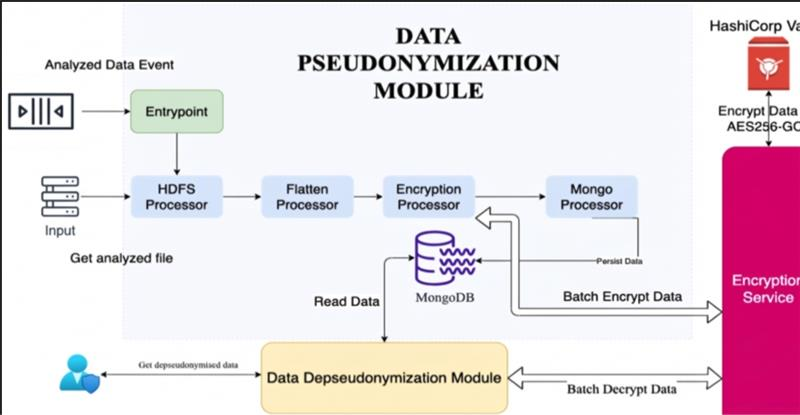
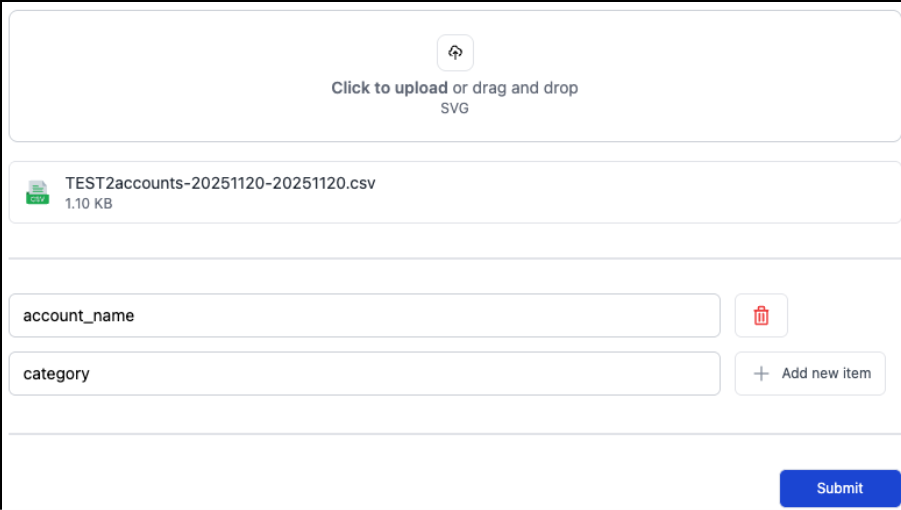

<div class="tool-header">
  <h1>CPS: CounteR Pseudonymization Tool</h1>
  <a href="https://assist-software.net/">
    
  </a>
</div>

## **General Description**
**CPS** is a DATAPACT tool that provides a structured frontend interface and REST APIs for executing pseudonymization workflows, allowing users to upload CSV files, select fields for encryption, and download the transformed datasets.
Used for data encryption/decryption, the service exposes a REST API for both operations.
The Data Pseudonymization module uses the encryption endpoints.
The Data Depseudonymization module uses the decryption endpoints.
This service abstracts the interaction with HashiCorp Vault.

## **Related Compliance aspects**
- GDPR's privacy-by-design
- Data pseudonymization
- Data minimization

## **Main Goal/Functionalities**
- Encrypts a single plaintext string
- Decrypts a single ciphertext string
- Encrypts a list of plaintext strings
- Decrypts a list of ciphertext strings
- Encrypts a list of plaintext strings stored within a CSV file
- UI Implementation

## **Architecture**

[]

## **Screenshots**
[]

## **Commercial Information**
| Organisation (s) | License Nature | License |
| ASSIST Software | Proprietary, ASSIST ​ | Proprietary, ASSIST  |


## **Expected KPIs**

|What (types)|How(Process)|Values|
|------------|------------|------|
|Privacy-preserving text and document pseudonymization with semantic consistency and entity-link preservation. Standalone REST API with batch processing and CSV support. |	Iterative development and integration in DATAPact ecosystem. Refactoring CPS as standalone REST API with batch support. Integration with DAVE and alignment with Keycloak authentication. Implementation of semantic pseudonymization with entity consistency checks. Standalone CSV endpoint for structured document processing. Functional testing in controlled environment, followed by pilot-based validation for TRL7 confirmation. | Pseudonymisation success rate: ≥90% of sensitive fields correctly pseudonymised. |


## **Related Project Links**
| Project Links |
| ------------- | 	
| GitHub Repository --> CPS <https://github.com/DATAPACT/counteR-pseudonymization-tool> |

## **How To Install**


At the moment, the chosen method of authentication is `userpass`.

This means Vault must be configured with this authentication method **enabled**
and a pair of user/pass that will be passed to the application.

Vault should also have `transit` **enabled** (https://www.vaultproject.io/docs/secrets/transit)

The vault user should have an attached policy configured as follows:

```
path "transit/encrypt/enc-key" {
  capabilities = [ "update" ]
}
path "transit/decrypt/enc-key" {
  capabilities = [ "update" ]
}
```

Here, the name of the enc/dec key is `enc-key` => this should the value for  `VAULT_ENCRYPTION_KEY_NAME` env var

# Requirements

## Environment

```
VAULT_URL=http://vault-server:8200
VAULT_USER=${user}
VAULT_PASSWORD=${password}
VAULT_ENCRYPTION_KEY_NAME=${enc-key}
```

# Dependencies

## Infrastructure

- HashiCorp Vault

# Technical Considerations

This project uses Quarkus, the Supersonic Subatomic Java Framework.

If you want to learn more about Quarkus, please visit its website: https://quarkus.io/ .

## Running the application in dev mode

You can run your application in dev mode that enables live coding using:

```shell script
./mvnw compile quarkus:dev
```

> **_NOTE:_**  Quarkus now ships with a Dev UI, which is available in dev mode only at http://localhost:8077/q/dev/.

## Packaging and running the application

The application can be packaged using:

```shell script
./mvnw package
```

It produces the `quarkus-run.jar` file in the `target/quarkus-app/` directory.
Be aware that it’s not an _über-jar_ as the dependencies are copied into the `target/quarkus-app/lib/` directory.

The application is now runnable using `java -jar target/quarkus-app/quarkus-run.jar`.

## Creating a native executable

You can create a native executable using:

```shell script
./mvnw package -Pnative
```

Or, if you don't have GraalVM installed, you can run the native executable build in a container using:

```shell script
./mvnw package -Pnative -Dquarkus.native.container-build=true
```

You can then execute your native executable with: `./target/code-with-quarkus-1.0.0-SNAPSHOT-runner`

If you want to learn more about building native executables, please consult https://quarkus.io/guides/maven-tooling.

## Related Guides

- Vault ([guide](https://quarkiverse.github.io/quarkiverse-docs/quarkus-vault/dev/index.html)): Store your credentials
  securely in HashiCorp Vault


## Vault docker image configuration
For local developement, run vault as a docker image.
```shell script
# Start Vault in dev mode
docker run --rm --name vault-dev --cap-add=IPC_LOCK \
  -e VAULT_DEV_ROOT_TOKEN_ID=root \
  -e VAULT_DEV_LISTEN_ADDRESS=0.0.0.0:8200 \
  -p 8200:8200 hashicorp/vault:latest server \
  -dev -dev-root-token-id=root -dev-listen-address=0.0.0.0:8200

# Enter the Vault container
docker exec -it vault-dev sh

# Set environment variables
export VAULT_ADDR=http://127.0.0.1:8200
export VAULT_TOKEN=root

# Check Vault status
vault status

# Enable userpass authentication
vault auth enable userpass

# Write the user with the correct policy name
vault write auth/userpass/users/admin password="Admin123!" policies="transit-encdec"

# Enable the transit secrets engine
vault secrets enable transit

# Create the encryption key
vault write -f transit/keys/enc-key

# Read the key info
vault read transit/keys/enc-key

# Write the policy using heredoc for clarity
vault policy write transit-encdec - <<'HCL'
path "transit/encrypt/enc-key" {
  capabilities = ["update"]
}
path "transit/decrypt/enc-key" {
  capabilities = ["update"]
}
HCL
```
This will configure the vault correctly. Afterwards, update application.yaml config file, for vault section
```shell script
  vault:
    url: http://localhost:8200
    authentication:
      userpass:
        username: admin
        password: Admin123!
```
