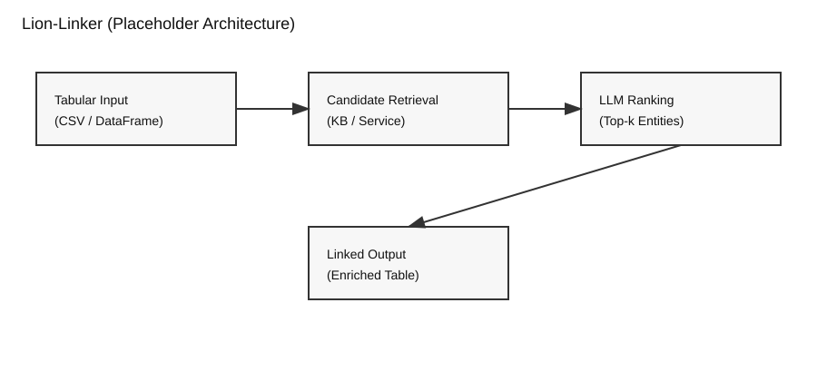

  <h1>Lion-Linker</h1>
  

## **General Description**
Lion-Linker is a Python library that uses large language models (LLMs) to perform entity linking and disambiguation for tabular data. It takes tabular inputs, retrieves candidate entities, and ranks them to produce linked entities that can be used for dataset enrichment and downstream analysis within DATAPACT workflows.

## **Related Compliance aspects**

- Data/AI pipeline step implementation for data enrichment

## **Main Goal/Functionalities**
- LLM-assisted entity linking and ambiguity resolution for tabular data
- Candidate ranking with top-k suggestions for ambiguous cells
- Outputs suitable for dataset enrichment and analysis workflows

## **Architecture**

## **Component Definition**
Lion-Linker is a modular library that accepts tabular inputs, integrates with external candidate retrieval services or knowledge bases, and applies LLM-based ranking to select the most relevant entity for each target cell. The resulting links can be exported as enriched tables or structured outputs for further processing.

## **Screenshots**

n/a

## **Commercial Information**

| Organisation (s) | License Nature | License |
|------------------|----------------|---------|
| SINTEF | Open Source | Apache License 2.0 |

## **Expected KPIs**

| What (types) | How (Process) | Values |
|--------------|----------------|--------|
| **Multi-Retriever Support** | Integration validation through end-to-end execution using different candidate retrieval services without modifying the ranking logic. Validation includes successful linking runs using each retriever backend. | Support for at least 3 retrieval backends: LamAPI, Wikidata Lookup API, and Wikidata SPARQL endpoint |
| **Multi-Ontology & Entity Type Support** | Demonstrated entity linking experiments using different ontology or semantic schemas. Validation includes configurable ontology selection and output aligned with ontology identifiers (e.g., URI, QID). | Support for at least 3 semantic targets such as: **schema.org** (general semantic vocabulary), **DPV / DPV-AI** (privacy and AI domain ontology), and **NER-derived type schema** with both coarse categories (e.g., Person, Organization, Location) and fine-grained entity types |
| **Explainability & Confidence Output** | Structured output validation ensuring that each linking decision includes explanation metadata and a numeric confidence score. | 100% of predictions include: selected entity, ranked candidate list (top-k), explanation of the selection, and confidence score |

## **Related Project Links**
| Project Links |
| ------------- |
| Related GitHub repository (Lion-Linker) <https://github.com/enRichMyData/lion_linker> |

## **How To Install**
The DATAPACT packaging for Lion-Linker is not yet published.
For updates, see the Lion-Linker repository: https://github.com/enRichMyData/lion_linker

### Detailed steps

n/a

## **How To Use**
For usage patterns and examples, see the Lion-Linker repository: https://github.com/enRichMyData/lion_linker

## **Other Information**

n/a

## **OpenAPI Specification**

n/a

## **Additional Links**

n/a
