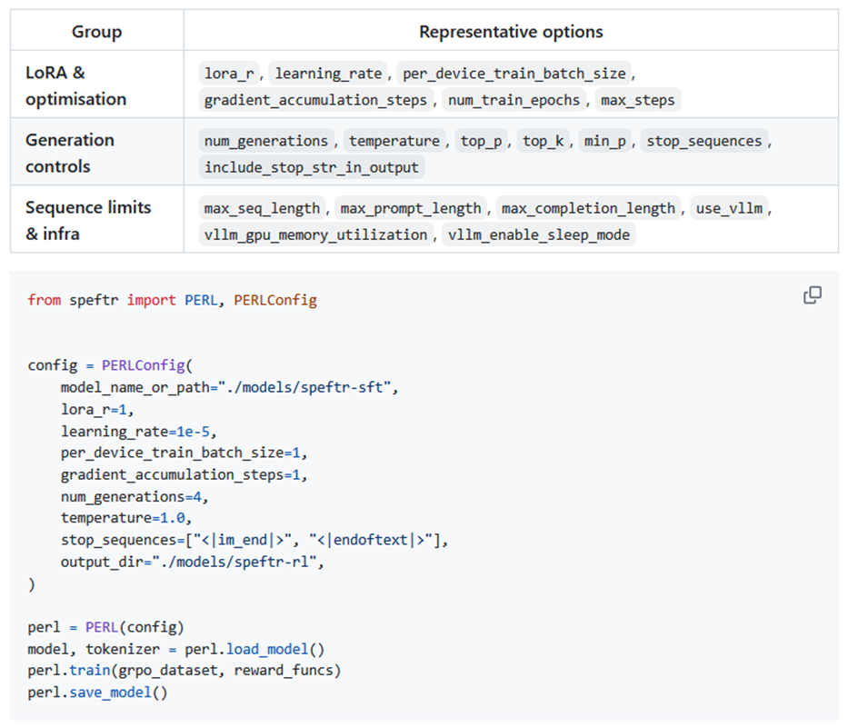

# SPEFTR: Simple-Parameter-Efficient-Fine-Tuning-Recipe

Powered by

<!--<p align="left">
  <a href="https://www.ijs.si/"></a>
</p>-->


## **General Description**

SPEFTR is a parameter-efficient fine-tuning pipeline that selects and applies adapters (e.g., LoRA/QLoRA) with quantization to optimize LLMs for domain tasks within the PipelineR.FR.LLM-llm-rag-ops.finetuning stack.

SPEFTR (Simple Parameter-Efficient Fine-Tuning Recipe) provides a lightweight, reproducible implementation of LoRA-based adaptation workflows for Large Language Models (LLMs). Instead of updating all model parameters, the base model remains frozen and only small low-rank adapter matrices are trained. This significantly reduces GPU memory requirements, storage footprint, and overall computational cost.

The repository supports both supervised fine-tuning and reinforcement learning workflows while remaining compatible with the Hugging Face ecosystem (`transformers`, `peft`, `accelerate`, `torch`). The implementation is designed to run efficiently on consumer-grade GPUs.

## **Commercial Information**

| Organisation (s) | License Nature | License |
| ---------------  | -------------- | ------- |
| Jožef Stefan Institute (JSI) | Open Source | BSD-2-Clause |

## **Top Features**

- Parameter-efficient training using LoRA
- Optional QLoRA-style quantization workflows
- Stable hyperparameter recipe
- Supervised Fine-Tuning (SFT) support
- Reinforcement Learning (GRPO) support
- Adapter hot-swapping for multi-task setups
- Hugging Face ecosystem compatibility
- Designed for reproducibility and practical deployment

## **Architecture**

SPEFTR follows a modular PEFT-based architecture:
Pretrained Transformer Model
↓
LoRA Adapter Injection (q_proj, k_proj, v_proj, o_proj, etc.)
↓
Training Pipeline (SFT or RL)
↓
Adapter Saving / Optional Merge
↓
Deployment / Inference


Key architectural characteristics:

- Base transformer weights remain frozen
- LoRA adapters injected into attention layers
- Configurable rank (`r`), alpha, dropout
- Optional quantized workflows (QLoRA-style setups)
- Adapter-only saving or merged model export

---

## **Component Definition**

| Component | Description |
|------------|-------------|
| `PESFT` | Parameter-Efficient Supervised Fine-Tuning pipeline |
| `PERL` | Parameter-Efficient Reinforcement Learning pipeline |
| `PESFTConfig` | Configuration class for supervised fine-tuning |
| `PERLConfig` | Configuration class for reinforcement learning |
| LoRA adapters | Low-rank parameter updates injected into transformer layers |
| GRPO | Group Relative Policy Optimization for lightweight RL training |
| Trainer utilities | Model loading, training, evaluation, and saving |


## **Expected KPIs**

| What (Types)            | How (Process)                                                                       | Values                                                                                                                                                                        |
| ---------------------------- | ------------------------------------------------------------------------------------- | ---------------------------------------------------------------------------------------------------------------------------------------------------------------------------------------- |
| Task performance KPIs (would show if recipe works) | Primary task metrics - classification (accuracy/F1)| Performance Retention % > 0.9. Acuracy >= 0.6 |


## **Screenshots**



## **How To Install**

| Project Links                                                            |
| ------------------------------------------------------------------------ |
| **Software GitHub Repository** → JSI SPEFTR `<https://github.com/lrei/simple_peft_recipe>` |
| **Progress GitHub Project** → `<https://github.com/lrei/simple_peft_recipe>`             |

For deploy/access please send an email to Inna Novalija (inna.koval@jsi.si)

### Requirements

- Python ≥ 3.13
- CUDA-compatible GPU (recommended for training)

### Software

Core dependencies include:

- torch ≥ 2.7.1  
- transformers ≥ 4.54.0  
- peft ≥ 0.17.1  
- accelerate ≥ 1.9.0  

### Summary of installation steps

1. Clone the repository  
2. Install dependencies using `uv`  
3. (Optional) Install reinforcement learning extras  

### Detailed steps

```bash
git clone https://github.com/lrei/simple_peft_recipe
cd simple_peft_recipe
uv sync


## **How To Use**

Supervised Fine-Tuning Example
from speftr import PESFT, PESFTConfig

config = PESFTConfig(
    model_name_or_path="unsloth/Qwen2.5-0.5B-Instruct",
    lora_r=8,
    lora_alpha=32,
    target_modules=["q_proj", "k_proj", "v_proj", "o_proj"],
    per_device_train_batch_size=16,
    learning_rate=2e-4,
    scheduler="constant",
    output_dir="./models/speftr-sft",
)

trainer = PESFT(config)

model, tokenizer = trainer.load_model()
trainer.train(train_dataset, eval_dataset, formatting_fn)
trainer.save_model()
```

## **Other Information**

n/a

## **OpenAPI Specification**

n/a

## **Additional Links**

n/a
