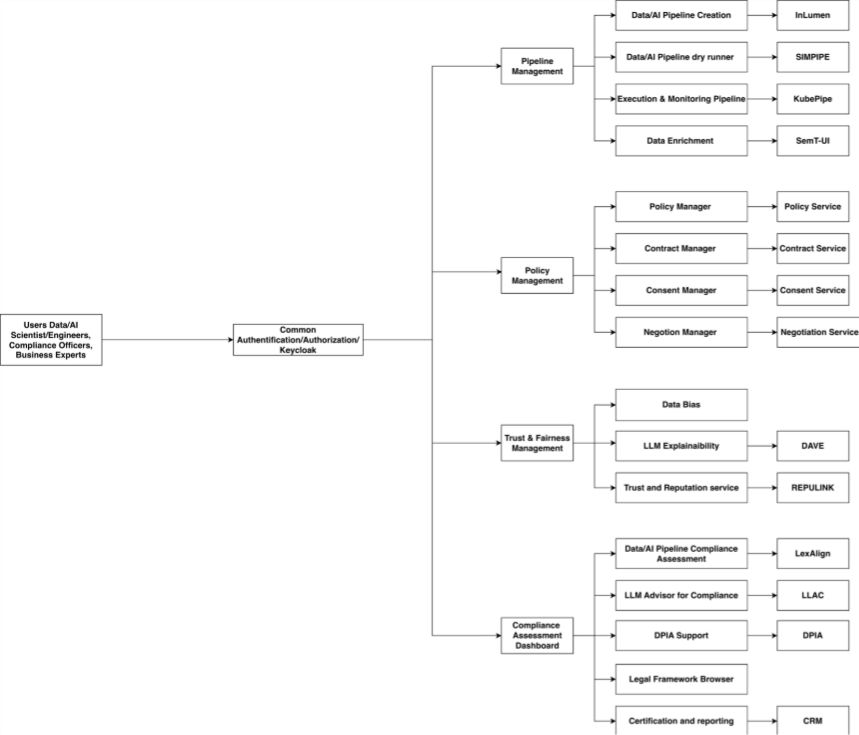
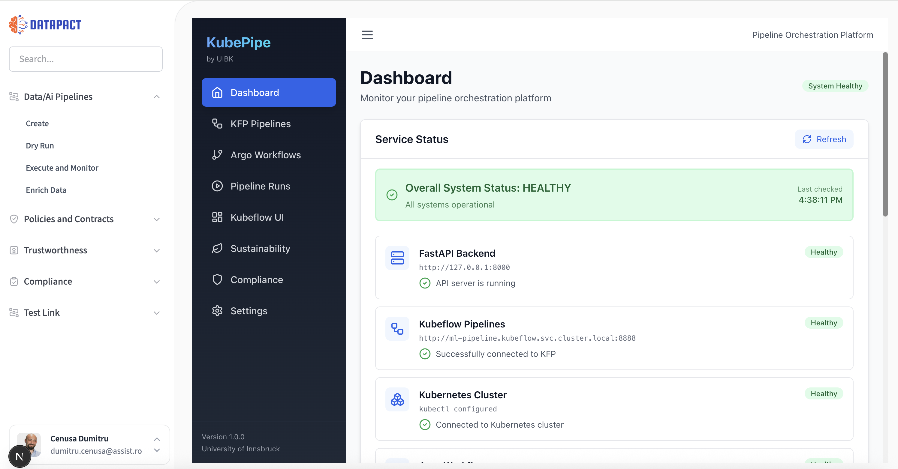

<div class="tool-header">
  <h1>TOOLBOX UI</h1>
  <a href="https://assist-software.net/">
    
  </a>
</div>

## **General Description**
**TOOLBOX UI** serves as the primary integration point for human-in-the-loop compliance tasks. It aggregates the interfaces of the underlying tools into a unified user interface.
Rather than accessing disparate services, users access the AI Legal Assistant for regulatory queries or the LexAlign visual editor directly through this portal via secure iframes. 
The portal handles the orchestration between these tools, allowing users to seamlessly transition from assessing a risk in the DPIA Support tool to viewing the final certification in the Compliance Result Manager. This unified frontend abstracts the underlying complexity of the microservices, providing a coherent, secure workflow for certification and reporting. 


## **Main Goal/Functionalities**
- Seamless Tool Deployment & Integration: Ensure that all tools can be deployed, integrated, and operate reliably within the platform.
- Validated & Reliable Tools: Guarantee that each deployed tool is fully tested, validated, and ready for use in sandbox and production environments
- Use Case Enablement: Ensure platform tools are fully integrated with all defined use cases, enabling end-to-end workflows
- Use Case Enablement: Ensure platform tools are fully integrated with all defined use cases, enabling end-to-end workflows
- Flexible Scenario Creation: Allow users to combine multiple tools dynamically to build custom execution scenarios.
- Robust Platform Foundation: Implement and maintain core services, including authentication (Keycloak), UI integration, iframe support, and application settings, to enable smooth platform operations.

## **Architecture**
[]

## **Commercial Information**
| Organisation (s) | License Nature | License |
| ASSIST Software | Proprietary, ASSIST ​ | Proprietary, ASSIST  |


|What (types)|How(Process)|Values|
|------------|------------|------|
|1. Tool Integration Success 2. Tool Validation Readiness 3. Use Case Integration Coverage 4. Sandbox Availability for Use Cases 5. Dynamic Tool Composition Support 6. Platform Core Services Operational |	1. Percentage of tools successfully integrated into the platform and operational after deployment (health checks + integration tests). 2. Percentage of integrated tools validated in the sandbox environment (API tests, functional checks). 3. Percentage of project use cases implemented and connected to the platform tools (APIs, orchestration, configuration). 4. Share of use cases with a sandbox environment for testing tools and pipelines before production deployment. 5. Percentage of use cases where users can combine multiple tools to create execution scenarios. 6. Availability and validation of core platform services (authentication, UI integration, configuration management). | 1. ≥95% tools integrated and operational 2. ≥95% validated before release 3. ≥90% use cases integrated 4. 100% prioritized use cases 5. ≥85% use cases support tool combinations 6. 100% implemented, ≥90% acceptance testing success |


# TOOLBOX UI
**ASSIST Software**




## **Related Project Links**
| Project Links |
| ------------- | 	
| GitHub Repository --> TOOLBOX UI <https://github.com/DATAPACT/toolbox-ui> |


## **How To Install**


First, run the development server:

```bash
npm run dev
# or
yarn dev
# or
pnpm dev
# or
bun dev
```

Open [http://localhost:3000](http://localhost:3000) with your browser to see the result.

You can start editing the page by modifying `app/page.tsx`. The page auto-updates as you edit the file.

This project uses [`next/font`](https://nextjs.org/docs/app/building-your-application/optimizing/fonts) to automatically optimize and load [Geist](https://vercel.com/font), a new font family for Vercel.

## Learn More

To learn more about Next.js, take a look at the following resources:

- [Next.js Documentation](https://nextjs.org/docs) - learn about Next.js features and API.
- [Learn Next.js](https://nextjs.org/learn) - an interactive Next.js tutorial.

You can check out [the Next.js GitHub repository](https://github.com/vercel/next.js) - your feedback and contributions are welcome!

## Deploy on Vercel

The easiest way to deploy your Next.js app is to use the [Vercel Platform](https://vercel.com/new?utm_medium=default-template&filter=next.js&utm_source=create-next-app&utm_campaign=create-next-app-readme) from the creators of Next.js.

Check out our [Next.js deployment documentation](https://nextjs.org/docs/app/building-your-application/deploying) for more details.
